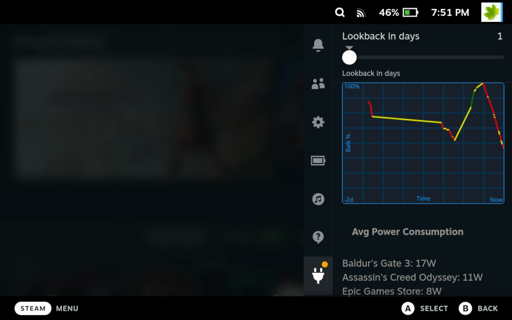

# Steam Deck Battery Tracker

Simple plugin to track battery history for your Steam Deck as well as power stats.



# How to install (it's not on the plugin store)

Make sure you have [decky loader](https://github.com/SteamDeckHomebrew/decky-loader) installed and have a a [sudo password](https://www.dexerto.com/tech/how-to-set-a-sudo-2031183/) set up. Go to desktop mode, in a terminal run

```
wget https://github.com/safijari/steam-deck-battery-tracker/releases/download/0.1.0/steam-deck-battery-tracker.zip -O /tmp/plugin_.zip && sudo unzip -o /tmp/plugin_.zip -d /home/deck/homebrew/plugins/ && sudo systemctl restart plugin_loader.service
```

You'll need to enter your sudo password during the installation. Once it's done you can go back to the game mode and the plugin should show up.